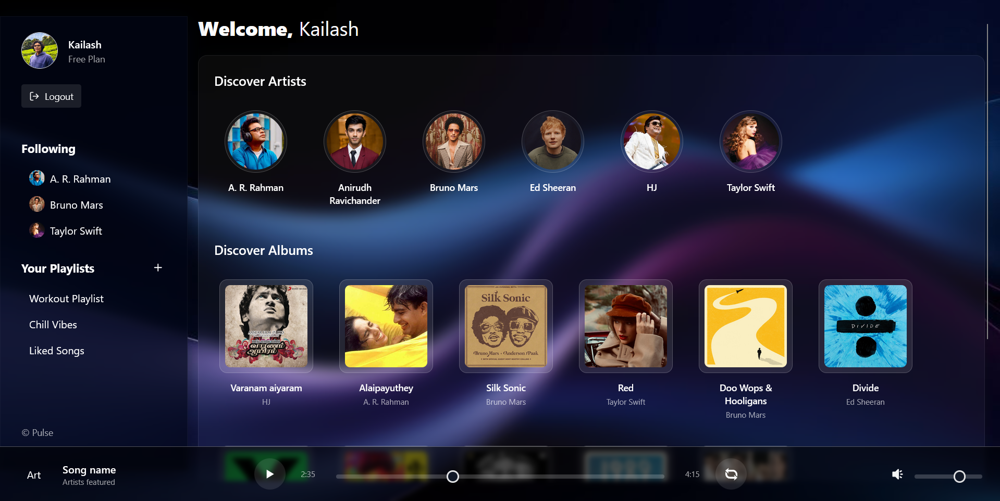
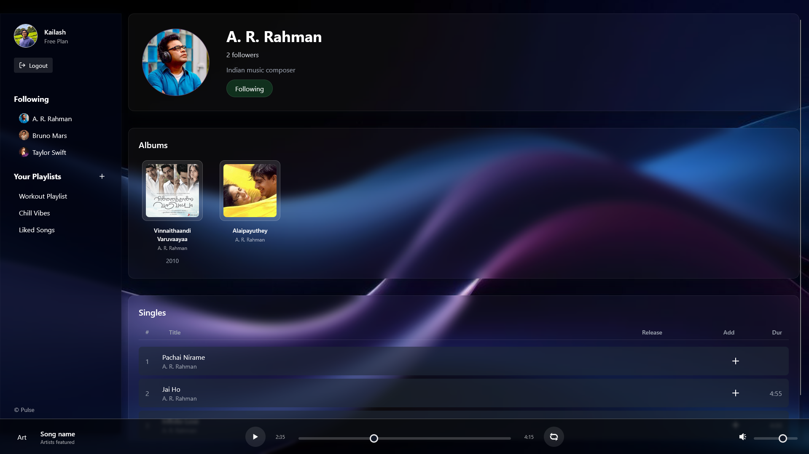
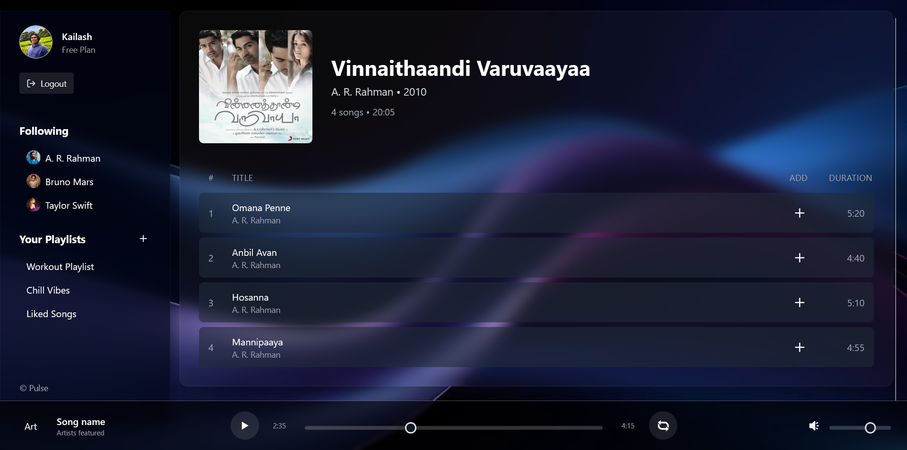
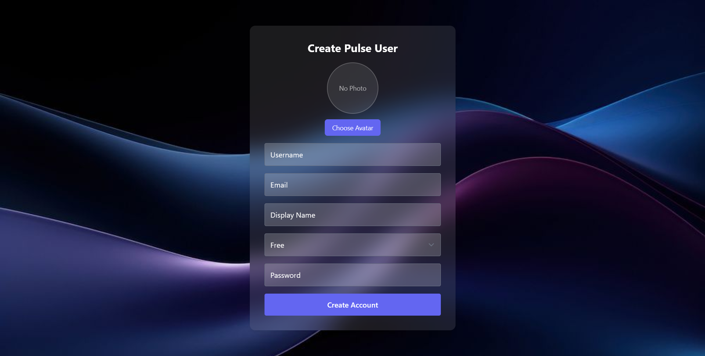

<div align="center">

# Pulse

### A Modern Full-Stack Music Streaming Platform

*A Spotify-inspired music streaming application built with React, Express.js and Oracle SQL, featuring separate experiences for listeners and creators.*

---


</div>

---

# Overview

Pulse is a modern full-stack music streaming platform inspired by contemporary music services such as Spotify while introducing a dedicated creator ecosystem and intelligent music discovery features.

The application provides two independent user experiences:

- **Pulse User** – Discover, stream and organize music.
- **Pulse Artist** – Publish content, manage releases and engage with listeners.

Unlike traditional streaming platforms, Pulse is designed with modular architecture, scalable backend services and enterprise software engineering practices.

---

# Project Goals

- Modern responsive user interface
- Secure authentication system
- Creator-focused dashboard
- Playlist management
- Music streaming
- Album and artist management
- Oracle SQL relational database
- RESTful API architecture
- Modular and scalable codebase

---

# Technology Stack

## Frontend

| Technology | Purpose |
|------------|---------|
| React 18 | UI Library |
| TypeScript | Type Safety |
| Vite | Build Tool |
| Tailwind CSS 3.3.4 | Styling |
| Zustand | Global State Management |
| React Router | Routing |
| Axios | HTTP Client |

---

## Backend

| Technology | Purpose |
|------------|---------|
| Node.js | Runtime |
| Express.js | REST API |
| JWT | Authentication |
| bcrypt | Password Hashing |
| Cookie Parser | Session Handling |
| CORS | Cross-Origin Requests |
| OracleDB Driver | Database Connectivity |

---

## Database

Oracle SQL

Core entities include

- Users
- Artists
- Albums
- Songs
- Genres
- Playlists
- Playlist Songs
- Subscriptions
- Followers
- Audio Metadata
- Listening History
- Notifications

---

# Key Features

## Authentication

- Secure password hashing using bcrypt
- JWT Authentication
- Cookie-based session handling
- Role-based authorization
- Separate authentication flows

### Pulse User

- Register
- Login
- Subscription selection
- Profile management

### Pulse Artist

- Artist onboarding
- Creator profile
- Music management
- Album publishing

---

# User Features

- Browse music
- Search songs
- Search artists
- Search albums
- Stream music
- Create playlists
- Edit playlists
- Follow artists
- Like songs
- Recently played
- Listening history
- Queue management
- Subscription plans

---

# Artist Features

- Artist Dashboard
- Upload singles
- Upload albums
- View followers
- Analytics dashboard
- Genre management
- Profile customization
- Release scheduling

---

# Innovative Features

## Pulse Mood Radio

Automatically generate playlists based on:

- Mood
- Energy
- Tempo
- Audio characteristics

---

## Collaborative Playlists

Multiple users can contribute to playlists together.

---

## Smart Discovery

Recommendation engine using:

- Listening history
- Favorite genres
- Similar artists
- Audio feature similarity

---

## Live Drops

Artists can release exclusive preview tracks to followers before official release.

---

# User Roles

```
Guest
 │
 ├── Browse Public Content
 │
 ▼

Pulse User
 │
 ├── Stream Music
 ├── Create Playlists
 ├── Subscribe
 └── Follow Artists

Pulse Artist
 │
 ├── Upload Music
 ├── Publish Albums
 ├── View Analytics
 └── Manage Profile
```

---

# Folder Structure

```
Pulse
│
├── client
│   ├── src
│   │   ├── assets
│   │   ├── components
│   │   ├── pages
│   │   ├── services
│   │   ├── state
│   │   ├── utils
│   │   ├── App.tsx
│   │   └── main.tsx
│   │
│   └── package.json
│
├── server
│   ├── config
│   ├── controllers
│   ├── middleware
│   ├── models
│   ├── routes
│   ├── utils
│   ├── server.js
│   └── package.json
│
└── README.md
```

---

# Application Architecture

```
                React + TypeScript
                       │
                React Router
                       │
                  Axios Client
                       │
────────────────────────────────────────
               Express REST API
────────────────────────────────────────
       JWT Authentication Middleware
                       │
          Business Logic Layer
                       │
              Oracle SQL Database
```

---

# Development Roadmap

- [x] Project Architecture
- [x] Frontend Setup
- [x] Authentication UI
- [x] Oracle SQL Integration
- [x] User Authentication
- [x] Artist Authentication
- [x] Playlist System
- [x] Music Streaming
- [x] Album Management
- [ ] Recommendation Engine
- [ ] Analytics Dashboard
- [ ] Deployment

---

# Installation

## Clone Repository

```bash
git clone https://github.com/username/Pulse.git
```

---

## Frontend

```bash
cd client

npm install

npm run dev
```

---

## Backend

```bash
cd server

npm install

npm start
```

---

# Environment Variables

```
PORT=

JWT_SECRET=

DB_USER=

DB_PASSWORD=

DB_CONNECTION_STRING=
```

---

# Security

- bcrypt password hashing
- JWT Authentication
- Protected Routes
- Role-Based Authorization
- Input Validation
- Secure API Architecture

---

# Future Enhancements

- AI-powered recommendations
- Lyrics synchronization
- Real-time chat
- WebSocket notifications
- Social listening
- Offline downloads
- Mobile application
- Admin dashboard
- Cloud deployment
- Docker support

---

# Screenshots

# Screenshots

## Home

<p align="center">
  
</p>

---

## Artist Dashboard

<p align="center">
  
</p>

---

## Album Page

<p align="center">
  
</p>

---

## Create / Upload

<p align="center">
  
</p>

---

# License

This project was developed for academic purposes as part of a Database Management Systems course while following modern full-stack software engineering practices.

---

<div align="center">

**Pulse**

Modern Music Streaming.
Designed for Listeners.
Built for Creators.

</div>
